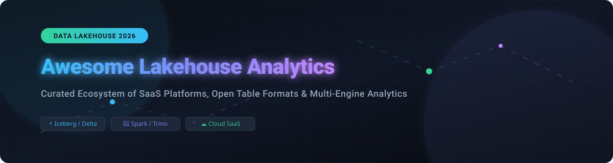

  

  
  
  
  
  
  

---

# 🌟 Awesome Lakehouse Analytics Platform

A curated catalog of premier **SaaS Cloud Platforms** and **Open-Source GitHub Projects** for **Data Lakehouse Architecture**, unified data analytics, and open table formats (Apache Iceberg, Delta Lake, Apache Hudi). 🚀

> 🔍 **SEO Keywords**: Data Lakehouse, Open Table Formats, Apache Iceberg, Delta Lake, Apache Hudi, Unified Data Analytics, Data Warehouse vs Data Lake, Cloud Data Engineering, Trino, Apache Spark, Snowflake, Databricks.

---

## 💡 Overview & Architecture Paradigm

The **Data Lakehouse** combines the cost-efficiency, flexibility, and scalability of cloud object storage (data lakes) with the reliability, ACID transactions, data governance, and high-performance querying of traditional data warehouses. ⚡ Built primarily around open table formats (**Apache Iceberg**, **Delta Lake**, **Apache Hudi**), lakehouses enable multi-engine analytics (SQL, Spark, real-time streaming, and AI/ML workloads) directly on open storage standards. 📊

---

## 📊 Market Landscape & Sector Analysis

> 📈 **Market Size & Structure**: The global **Data Lakehouse & Cloud Analytics Platform sector** is estimated at **$12.6 Billion to $17.1 Billion in 2026** (projected to reach over $40 Billion by 2032 at ~25% CAGR). The market structure is **moderately concentrated**—dominated by cloud hyperscalers (AWS, Azure, Google Cloud) and major platform vendors (Databricks, Snowflake), yet **non-winner-take-all** due to enterprise multi-cloud mandates, open storage standards, and specialized query engine innovation (Trino, DuckDB, Dremio). 🌐

---

## ☁️ SaaS & Managed Cloud Platforms

Below is a comprehensive comparison of leading managed and SaaS lakehouse analytics platforms, sorted in **descending order by company scale (Valuation / Parent Market Cap / Revenue)**. 🏢

| 🏢 SaaS Platform | 💰 Company Scale (Valuation / Revenue) | 🏷️ Starting Tier Pricing | 🎁 Free Tier & Free Trial Limits | ⚡ Key Features & Architecture Focus |
| :--- | :--- | :--- | :--- | :--- |
| **[Azure Databricks](https://azure.microsoft.com/products/databricks/)** | **$3.1 Trillion** (Parent MSFT Market Cap / Databricks $190B Val) | Starts at **$0.40 / DBU** (Premium tier) + Azure VM compute rates | **14-Day Trial** with $200 Azure credits + 14-day free Databricks units ($400 value) | First-party Azure service with Unity Catalog, Delta Lake native execution, enterprise security, and AI integrations. |
| **[Google Cloud BigLake](https://cloud.google.com/biglake)** | **$2.1 Trillion** (Parent Alphabet Market Cap) | Starts at **$0.04 / GiB / month** for metadata + $6.25 / TiB BigQuery compute | **1 GiB metadata/mo & 1 TiB queries/mo forever free** + $300 new account credits (90 days) | Unified storage engine across Google Cloud, AWS, and Azure with open table format support (Iceberg) and BigQuery engine. |
| **[AWS Lake Formation](https://aws.amazon.com/lake-formation/)** | **$2.0 Trillion** (Parent Amazon Market Cap) | **$0.00 / hr** for Lake Formation service; billed per S3 ($0.023/GB/mo) & Athena ($5/TB scanned) | **12 Months AWS Free Tier** (5 GB S3, 1M Glue catalog requests/mo, 1 TB Athena queries/mo) | Centralized security, data sharing, fine-grained access control, and cataloging for S3 lakehouses across AWS services. |
| **[Databricks](https://www.databricks.com/)** | **$190 Billion** (Valuation, ~$7B ARR) | Starts at **$0.40 / DBU** (Premium tier pay-as-you-go serverless/managed) | **14-Day Free Trial** with up to $400 free usage credits; Free Community Edition with single micro-cluster limit | Unified Data & AI Lakehouse platform created by the founders of Spark, Delta Lake, and MLflow with serverless compute. |
| **[Snowflake](https://www.snowflake.com/)** | **$120 Billion** (Market Cap, ~$4.7B FY26 Rev) | Starts at **$2.00 / credit** (Standard) or **$3.00 / credit** (Enterprise) + $23/TB/mo storage | **30-Day Free Trial** with up to $400 in free usage credits | Cloud AI Data Cloud supporting Iceberg tables, hybrid data architectures, Snowflake Horizon governance, and Snowpark. |
| **[Upsolver](https://www.upsolver.com/)** | **$10 Billion** (Acquired by Qlik / Parent Scale) | Starts at **$0.09 / UPU (Upsolver Processing Unit) / hour** | **30-Day Free Trial** with up to $500 in processing and streaming ingestion credits | Automated lakehouse ingestion, continuous data preparation, and self-optimizing tables for Iceberg on cloud storage. |
| **[Cloudera Data Platform](https://www.cloudera.com/)** | **$5.3 Billion** (Valuation, ~$1.0B ARR) | Starts at **$0.08 / CCU (Cloudera Compute Unit) / hour** + cloud VM infra | **30-Day Free Trial** on AWS/Azure with up to $1,000 credit limit | Enterprise hybrid & multi-cloud open data lakehouse with Iceberg support, SDX governance, and Apache stack integration. |
| **[Starburst Galaxy](https://www.starburst.io/platform/starburst-galaxy/)** | **$3.35 Billion** (Valuation, ~$100M ARR) | Starts at **$0.50 / SBC (Starburst Credit)** | **30-Day Free Trial** with $500 in free execution credits | Fully managed Trino SQL query engine for high-performance lakehouse analytics across multi-cloud object stores and databases. |
| **[Dremio](https://www.dremio.com/)** | **$2.0 Billion** (Valuation) | Starts at **$0.39 / DCU (Dremio Control Unit) / hour** (Enterprise Cloud) | **Forever Free Tier** (up to 5 concurrent DCUs at $0 software cost) + 30-Day Enterprise Trial ($400 credits) | High-speed self-service SQL lakehouse engine powered by Apache Arrow, supporting Iceberg catalog management and sub-second SQL queries. |
| **[Onehouse](https://www.onehouse.ai/)** | **$68 Million** (Total Funding, ~$250M Valuation) | Starts at **$0.05 / OCU (Onehouse Compute Unit) / hour** | **30-Day Free Trial** with up to $1,000 in free data processing credits | Fully managed cloud data service providing universal table format interoperability (Hudi, Iceberg, Delta) and continuous ingestion. |

---

## 🔓 Open-Source GitHub Projects

Curated open-source engines, table formats, and frameworks powering modern open lakehouses, sorted in **descending order by GitHub Star count**. ⭐

- **[Apache Spark](https://github.com/apache/spark)**   
  *Foundational unified analytics engine for large-scale data processing, supporting batch, streaming, SQL, ML, and native lakehouse table format integration.* 💥

- **[DuckDB](https://github.com/duckdb/duckdb)**   
  *High-performance in-process analytical SQL database engine optimized for local lakehouse analytics, direct Parquet/Iceberg querying, and zero-copy data processing.* 🦆

- **[Apache Flink](https://github.com/apache/flink)**   
  *Stateful stream processing framework providing real-time stream ingestion, CDC processing, and low-latency continuous pipeline execution for data lakes.* 🌊

- **[Apache Arrow](https://github.com/apache/arrow)**   
  *Development platform for in-memory analytics offering columnar memory format, zero-copy data interchange, and high-speed multi-engine acceleration.* 🏹

- **[Presto](https://github.com/prestodb/presto)**   
  *Distributed SQL query engine for big data analytics, running fast queries against petabyte-scale data lakes and heterogeneous data sources.* ⚡

- **[dbt-core](https://github.com/dbt-labs/dbt-core)**   
  *Analytics engineering framework for transforming data in SQL/Python on top of open table formats and cloud data platforms.* 🛠️

- **[Trino](https://github.com/trinodb/trino)**   
  *Fast distributed SQL query engine designed for interactive analytics, federated querying, and high-concurrency lakehouse workloads.* 🐰

- **[LanceDB](https://github.com/lancedb/lancedb)**   
  *Developer-friendly embedded vector and columnar database for AI lakehouses, native to the open Lance columnar file format.* 🤖

- **[Apache DataFusion](https://github.com/apache/datafusion)**   
  *Extensible, high-performance SQL query engine written in Rust using Apache Arrow for next-generation lakehouse analytics.* 🦀

- **[Apache Iceberg](https://github.com/apache/iceberg)**   
  *High-performance open table format for huge analytic datasets, providing ACID transactions, schema evolution, partition spec evolution, and time travel.* 🧊

- **[Delta Lake](https://github.com/delta-io/delta)**   
  *Open-source storage layer bringing ACID transactions, scalable metadata handling, and batch/streaming unification to object stores.* 🔺

- **[Apache Hudi](https://github.com/apache/hudi)**   
  *Data lake platform enabling incremental processing, upserts, change data capture (CDC), and record-level table updates on cloud storage.* ⏱️

- **[Unity Catalog](https://github.com/unitycatalog/unitycatalog)**   
  *Universal open governance solution for data and AI, providing centralized access control, lineage, and metadata management across multi-engine lakehouses.* 🔒

- **[Apache Paimon](https://github.com/apache/paimon)**   
  *Streaming data lake format optimized for real-time data ingestion, high-speed updating, and streaming SQL queries.* ⚡

---

## 🏗️ Recommended Reference Architectures

A typical modern **Open Lakehouse Stack** consists of: 🧱
1. **☁️ Object Storage**: AWS S3, Azure Data Lake Storage (ADLS Gen2), Google Cloud Storage (GCS), or MinIO.
2. **🧊 Open Table Formats**: Apache Iceberg, Delta Lake, or Apache Hudi.
3. **⚙️ Ingestion & Processing Engines**: Apache Spark, Apache Flink, or Upsolver/Onehouse.
4. **🔍 Interactive Query & Federation Engines**: Trino, Presto, Dremio, DuckDB, or Apache DataFusion.
5. **🛠️ Transformation & Orchestration**: dbt-core, Apache Airflow, Dagster, or Prefect.
6. **🔒 Governance & Catalog Layer**: Apache Polaris, Unity Catalog, or AWS Glue Data Catalog.

---

## 🤝 How to Contribute

Contributions are warmly welcomed! 🎉 To submit a new tool, platform, or open-source project:

1. Fork this repository. 🍴
2. Add your entry to `README.md` maintaining table/sorting alignment. 📝
3. Ensure pricing, free tier limits, and links are verified. 🔍
4. Create a Pull Request with a clear summary. 🚀

---

## 💖 Support & Community

Thank you for exploring and using **Awesome Lakehouse Analytics Platform**! 💫 If you find this catalog helpful:

- ⭐ **Star** this repository to show your appreciation and help others discover it.
- 🍴 **Fork** and contribute to keep the lakehouse ecosystem updated.
- 📢 **Share** with your fellow data engineers, architects, and analytics teams!

  
  

---

## 📈 Star History

---

## 📜 License & Disclaimer

- License: [MIT License](LICENSE) 📄
- Disclaimer: This is a community-curated list for research and educational purposes. Pricing, free tier specifications, and financial metrics are subject to vendor updates.

---
*Maintained with ❤️ by the open data engineering community.*
